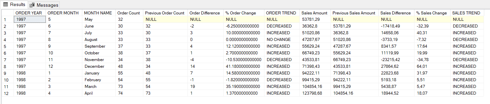

# Monthly Sales Trend Analysis

This project analyzes monthly sales trends and month-over-month changes using SQL on the Northwind database.

## Business Problem

The sales manager wants to know how monthly sales and order counts have changed over the last 12 months.

## Objective

Analyze monthly sales performance for the last 12 complete months in the Northwind dataset.

**Note:** May 1998 is excluded from the analysis because it contains partial monthly data.

## KPIs

- Order Count
- Sales Amount
- Month-over-Month Order Change (%)
- Month-over-Month Sales Change (%)

## SQL Techniques Used

- CTE
- JOIN
- GROUP BY
- Aggregate Functions
- LAG
- CASE WHEN
- DATEFROMPARTS

## Business Insights

- April 1998 had the highest order count and sales amount.
- June 1997 had the lowest order count and sales amount.
- December 1997 showed the highest increase.
- November 1997 showed the largest decrease.
- February 1998 had an opposite trend between order count and sales amount.
- August 1997 had the same order count but a lower sales amount than the previous month.

  ## Result Preview

