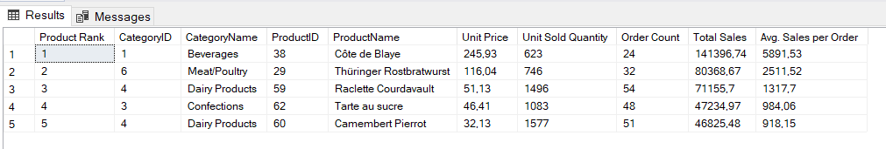

# Top Products Analysis

## Business Problem

The sales manager wants to identify the best-selling products based on total sales.

## Objective

Analyze product sales performance and identify the top-selling products.

## KPIs

- Product ID
- Product Name
- Category
- Unit Price
- Total Sales
- Order Count
- Unit Sold Quantity
- Average Sales per Order
- Product Rank

## SQL Concepts Used

- CTE (Common Table Expression)
- JOIN
- GROUP BY
- Aggregate Functions (SUM, AVG, COUNT)
- COUNT(DISTINCT)
- ROUND()
- DENSE_RANK()
- TOP

## Insights

### Insight 1
- Although Côte de Blaye appeared in only 24 orders, it generated the highest total sales thanks to its high unit price and 623 units sold.

### Insight 2
- Total sales are influenced not only by the number of orders but also by product price and the quantity sold.

## Result Preview

